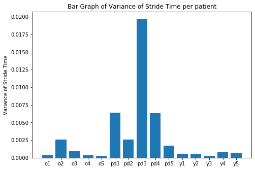

# Gait Monitoring for Parkinson's Disease Patients
**Mentor**: Arthur Tay

To monitor gait patterns to detect freezing of gait. Done as part of Singapore Science Mentorship Programme.

## Table of Contents
- [Gait Monitoring for Parkinson's Disease Patients](#gait-monitoring-for-parkinson-s-disease-patients)
  * [Project Description](#project-description)
  * [Final Product](#final-product)
  * [Methodology](#methodology)
  * [GaitDB Dataset](https://www.physionet.org/content/gaitdb/1.0.0/)
    + [Data Description](#data-description)
    + [Method Used](#method-used)
  * [Daphnet Dataset](https://archive.ics.uci.edu/ml/datasets/Daphnet+Freezing+of+Gait)
    + [Data Description](#data-description-1)
    + [Data Attributes](#data-attributes)
      - [Annotations](#annotations)
    + [LICENCE](#licence)
  * [VGRF Dataset](https://physionet.org/content/gaitpdb/1.0.0/)
    + [Data Description](#data-description-2)
    + [Data format](#data-format)
    + [Data file names](#data-file-names)


## Project Description
The objective of this project is to monitor the gait patterns for people with Parkinson Disease. We will analyse the gait for PD patients during freezing and non-freezing (normal) events. Various parameters (e.g. cadence, step lengths, stride lengths, etc) related to gait will be derived from motion sensors (accelerometers, gyroscopes, magnetometers) using public datasets of PD patients. We will then investigate which of these parameters is most suitable for classification for freezing of gait in PD patients.

## Final Product
To make use of signal processing algorithms in extracting gait parameters from motion sensors and identifying most suitable parameters for classification of freezing of gait in PD patients.

## Methodology
Students will first need to review and understands how to extract gait parameters from motion sensors. There are different algorithms in the literature and they will need to investigate which is most suitable. They will then make use of a PD patient public dataset to test out their methods. If time permits, they will learn basic machine learning tools for classification.

## [GaitDB Dataset](https://www.physionet.org/content/gaitdb/1.0.0/)

### Data Description

Walking stride interval time series included are from 15 subjects: 5 healthy young adults (23 - 29 years old), 5 healthy old adults (71 - 77 years old), and 5 older adults (60 - 77 years old) with Parkinson's disease. The file name indicates old (o), young (y) or Parkinson's disease (pd). For the old and young subjects, the age (in years) is also included in the filename.

Subjects walked continuously on level ground around an obstacle-free path. The stride interval was measured using ultra-thin, force sensitive resistors placed inside the shoe. The analog force signal was sampled at 300 Hz with a 12 bit A/D converter, using an ambulatory, ankle-worn microcomputer that also recorded the data. Subsequently, the time between foot-strikes was automatically computed. The method for determining the stride interval is a modification of a previously validated method that has been shown to agree with force-platform measures, a “gold” standard.

Data were collected from the healthy subjects as they walked in a roughly circular path for 15 minutes, and from the subjects with Parkinson’s disease as they walked for 6 minutes up and down a long hallway.

### Method Used
We calculated the variance of the data and were able to find a correlation between the variance and the diagnosis. 

Based on this result, we employed a rather simplistic classification algorithm using Logistic Regression to find a value that corresponded. 

The result was not as accurate as would be reliable, but that was mainly due to some corner cases. Below are the results.

| Precision | Recall or Sensitivity | Specificity | Accuracy | F1 Score |
| --- | --- | --- | --- | --- |
| 0.80 | 0.80 | 0.90 | 0.867 | 0.80 |


## [Daphnet Dataset](https://archive.ics.uci.edu/ml/datasets/Daphnet+Freezing+of+Gait)
(suggested by Prof Tay)

### Data Description

The Daphnet Freezing of Gait Dataset Freezing of Gait in users with Parkinson disease (hereafter Daphnet Freezing of Gait Dataset) is a dataset devised to benchmark automatic methods to recognize gait freeze from wearable acceleration sensors placed on legs and hip.

The dataset was recorded in the lab with emphasis on generating many freeze events. Users performed there kinds of tasks: straight line walking, walking with numerous turns, and finally a more realistic activity of daily living (ADL) task, where users went into different rooms while fetching coffee, opening doors, etc.

This dataset is the result of a collaboration between the Laboratory for Gait and Neurodynamics, Tel Aviv Sourasky Medical Center, Israel and the Wearable Computing Laboratory, ETH Zurich, Switzerland. Recordings were run at the Tel Aviv Sourasky Medical Center in 2008. The study was approved by the local Human Subjects Review Committee, and was performed in accordance with the ethical standards of the Declaration of Helsinki.

This dataset was collected as part of the EU FP6 project Daphnet, grant number 018474-2.
Additional effort to publish this dataset was supported in part by the EU FP7 project CuPiD, grant number 288516.

### Data Attributes
1. Time of sample in millisecond
2. Ankle (shank) acceleration - horizontal forward acceleration (mg)
3. Ankle (shank) acceleration - vertical (mg)
4. Ankle (shank) acceleration - horizontal lateral (mg)
5. Upper leg (thigh) acceleration - horizontal forward acceleration (mg)
6. Upper leg (thigh) acceleration - vertical (mg)
7. Upper leg (thigh) acceleration - horizontal lateral (mg)
8. Trunk acceleration - horizontal forward acceleration (mg)
9. Trunk acceleration - vertical (mg)
10. Trunk acceleration - horizontal lateral (mg)
11. Annotations (see Annotations section)

#### Annotations
The meaning of the annotations are as follows:

- **0** - not part of the experiment. For instance the sensors are installed on the user or the user is performing activities unrelated to the experimental protocol, such as debriefing
- **1** - experiment, no freeze (can be any of stand, walk, turn)
- **2** - freeze

### LICENCE

Use of this dataset in publications must be acknowledged by referencing the following publication:

Marc Bächlin, Meir Plotnik, Daniel Roggen, Inbal Maidan, Jeffrey M. Hausdorff, Nir Giladi, and Gerhard Tröster, Wearable Assistant for Parkinson's Disease Patients With the Freezing of Gait Symptom. IEEE Transactions on Information Technology in Biomedicine, 14(2), March 2010, pages 436-446

This paper describes the dataset in details. It explain the data acquisition protocol, the kind of sensor used and their placement, and the nature of the data acquired. It also provides baseline results for the automated detection of freezing of gait, against which newer methods can be benchmarked. In particular it describes detection sensitivity/specificity for 3 sensor placements and 4 kinds of derived sensor signals, it analyzes detection latency, and provides first insight into user specific v.s. user independent performance.

We also appreciate if you inform us (daniel.roggen@ieee.org) of any publication using this dataset for cross-referencing purposes.

## [VGRF Dataset](https://physionet.org/content/gaitpdb/1.0.0/)
### Data Description

Parkinson's disease (PD) is one of the most common movement disorders, affecting approximately 1 million Americans (estimates range between 4 and 6.5 million people worldwide) and about 1% of older adults. In the US alone, 60,000 new cases are diagnosed each year. PD is a chronic and progressive neurological disorder that results in tremor, rigidity, slowness, and postural instability. A disturbed gait is a common, debilitating symptom; patients with severe gait disturbances are prone to falls and may lose their functional independence.

This database contains measures of gait from 93 patients with idiopathic PD (mean age: 66.3 years; 63% men), and 73 healthy controls (mean age: 66.3 years; 55% men). The database includes the vertical ground reaction force records of subjects as they walked at their usual, self-selected pace for approximately 2 minutes on level ground. Underneath each foot were 8 sensors ([Ultraflex Computer Dyno Graphy, Infotronic Inc.](http://www.infotronic.nl/#CDG)) that measure force (in Newtons) as a function of time. The output of each of these 16 sensors has been digitized and recorded at 100 samples per second, and the records also include two signals that reflect the sum of the 8 sensor outputs for each foot. For details about the format of the data, please see [this note](https://physionet.org/content/gaitpdb/1.0.0/format.txt).

With this information, one can investigate the force record as a function of time and location, derive measures that reflect the center-of-pressure as a function of time, and determine timing measures (e.g., stride time, swing time) for each foot as functions of time. Thus, one can study the stride-to-stride dynamics and the variability of these time series.

This database also includes demographic information, measures of disease severity (i.e., using the Hoehn & Yahr staging and/or the Unified Parkinson's Disease Rating Scale) and other related measures (available in HTML or xls spreadsheet format).

A subset of the database includes measures recorded as subjects performed a second task (serial 7 subtractions) while walking, as in the figure above, which shows excerpts of swing time series from a patient with PD (lower panels) and a control subject (upper panels), under usual walking conditions (at left) and when performing serial 7 subtractions (at right). Under usual walking conditions, variability is larger in the patient with PD (Coefficient of Variation = 2.7%), compared to the control subject (CV = 1.3%). Variability increases during dual tasking in the subject with PD (CV = 6.5%), but not in the control subject (CV = 1.2%). From Yogev et al. (reference [4] below).

### Data format

Each line contains 19 columns:

| Column | Description |
|--------|-------------|
| 1 | Time (in seconds)|
| 2-9 | **Vertical ground reaction force** (VGRF, in Newton) on each of 8 sensors located under the left foot |
| 10-17 |VGRF on each of the 8 sensors located under the right foot |
| 18 | Total force under the left foot |
| 19 | Total force under the right foot |


When a person is comfortably standing with both legs parallel to each
other, sensor locations inside the insole can be described (according
to the [Infotronic website](http://www.infotronic.nl/)) as lying
approximately at the following (X,Y) coordinates, assuming that the
origin (0,0) is just between the legs and the person is facing towards
the positive side of the Y axis:

| Sensor | X    | Y    |
|--------|------|------|
| L1     | -500 | -800 |
| L2     | -700 | -400 |
| L3     | -300 | -400 |
| L4     | -700 | 0    |
| L5     | -300 | 0    |
| L6     | -700 | 400  |
| L7     | -300 | 400  |
| L8     | -500 | 800  |
| R1     | 500  | -800 |
| R2     | 700  | -400 |
| R3     | 300  | -400 |
| R4     | 700  | 0    |
| R5     | 300  | 0    |
| R6     | 700  | 400  |
| R7     | 300  | 400  |
| R8     | 500  | 800  |

The X and Y numbers are in an arbitrary coordinate system reflecting
the relative (arbitrarily scaled) positions of the sensors within each
insole. During walking, the sensors inside each insole remain at the
same relative position, but the two feet are no longer parallel to
each other. Thus, this coordinate system enables a calculation of a
proxy for the location of the center of pressure (COP) under each
foot.


### Data file names
These follow a common convention, e.g., ```GaCo01_02.txt```  or  ```JuPt03_06.txt```, where

- Ga, Ju or Si – indicate the study from which the data originated:
 - Ga - Galit Yogev et al ([dual tasking in PD; Eur J Neuro, 2005](https://onlinelibrary.wiley.com/doi/abs/10.1111/j.1460-9568.2005.04298.x))
 - Ju – Hausdorff et al ([RAS in PD; Eur J Neuro, 2007](https://onlinelibrary.wiley.com/doi/abs/10.1111/j.1460-9568.2007.05810.x))
 - Si - Silvi Frenkel-Toledo et al ([Treadmill walking in PD; Mov Disorders, 2005](https://onlinelibrary.wiley.com/doi/abs/10.1002/mds.20507))

- Co or Pt: Control subject or a PD Patient respectively

- 01: Subject number in the group

- A walk number of 10  (for the "Ga" study) indicates a dual-task walking,
where the subject was engaged in serial-7 subtraction while walking.

- A walk number of 01 refers to a usual, normal walk. 

The sampling rate was 100 Hz.
