# Gait Analyzer
**done by Prannaya Gupta**

Done as part of Project for CS4131 Module at NUS High School.


The Gait Analyzer is an Android Application made to monitor and analyse gait patterns in Parkinson’s Disease Patients. This was made in conjunction to SMP 2020, wherein an Arduino prototype was created. This application uses phone sensors to monitor these gait patterns and performs simplistic signal processing.

Powered by Kotlin, this application is designed for portability. There are two different systems, and users can sign in either as a Patient or a Caregiver. The Patient has the option to activate a “Walk Mode” such that when he walks, events such as Freeze Events or Fall Events will be detected an appropriate action will be taken to counteract the effects of these events.

## Introduction

Parkinson’s Disease (PD) is a progressive nervous system disorder that affects the basal ganglia, resulting in the progressive loss of dopamine neurotransmitters and poorer connection between the central nervous system and muscles. This leads to many gait abnormalities, mainly tremors, bradykinesia, rigidity, and a loss of postural reflexes. Secondary motor symptoms that are evoked include stride length reduction, shuffling gait, step festination and freezing. Freezing of Gait (FOG) is one of the most debilitating effects of PD and is defined as a brief, episodic absence or marked reduction of forward progression of the feet despite the intention to walk. It has serious social and clinical consequences for patients as it leads to falls, interferes with daily activities, and significantly impacts quality of life. While FOG can happen anytime, it happens most often during turns, before gait initiation, in tight quarters such as doorways and in stressful situations. It is triggered by visual stimulation.

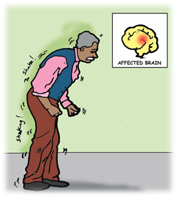

## Class Design

This application was developed using Gradle and mostly uses Kotlin, with some sections coded with HTML and displayed using an Android WebView. There have also been multiple UI components created in a separate directory called androidlib and functions created in another separate directory called ktlib. Due to the complexity of this project, I will be going over only a few of these classes and directories. You can also see a macroscopic example of the entire directory structure below.

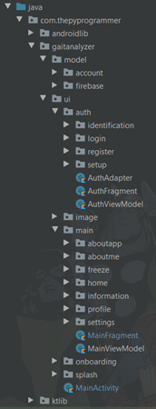

### `model` subpackage

The model classes are made to ease Firebase usage and manage login/register. User is the main class and Patient and Caregiver are subclasses to detail the user. FirebaseUtil itself houses many data fields that are used to access Firebase and its many functions, e.g. User Data storage in Cloud Firestore and Image and Freeze storage in Cloud Storage. 

These 4 classes handle all the login functionalities aside from the authorization view classes. Result is an autogenerated file that configures the Login and Register of the application.

```kotlin
sealed class Result<out T : Any> {

    data class Success<out T : Any>(val data: T) : Result<T>()
    data class Error(val exception: Exception) : Result<Nothing>()

    override fun toString(): String {
        return when (this) {
            is Success<*> -> "Success[data=$data]"
            is Error -> "Error[exception=$exception]"
        }
    }
}

```

This is a class that allows use to either create a Success using the User or Error using the exception thrown. This allows the authorization to be much easier, since this can create a pseudo-listener.

### androidlib subpackage

The androidlib subpackage deals with the view components and custom views I have created in the project. Examples include viewpager.ViewPagerAdapter, web.GitHubWebViewClient and video.FunctionalVideoView. These classes each serve a different purpose but increase usability a lot more. For example, you can toggle the play-pause setting of the FunctionalVideoView and set a PlayPauseListener to listen when the video is played or paused. ViewPagerAdapter is also an Adapter class that creates a ViewPager based on a list of fragments rather than a code snippet that makes it override the function. 

```kotlin
open class ViewPagerAdapter(
    fa: FragmentActivity,
    private val fragmentList: List<Fragment> = mutableListOf()
) : FragmentStateAdapter(fa) {
    override fun getItemCount(): Int = fragmentList.size

    override fun createFragment(position: Int) = fragmentList[position % itemCount]
}
```

This is an example of abstraction that I have utilised in this application.

The androidlib.tts subpackage also contains the file TextToSpeechUtils, which allows easier usage of TextToSpeech. As shown below, this is the code.

```kotlin
fun TextToSpeech.getTTS(context: Context?, text: String) =
    TextToSpeech(context) {
        if (it == TextToSpeech.SUCCESS) {
            val result = this.setLanguage(Locale.US)
            if (!(result == TextToSpeech.LANG_MISSING_DATA || result == TextToSpeech.LANG_NOT_SUPPORTED)) {
                speak(text)
            }
        }
    }

fun TextToSpeech.speak(text: String) {
    speak(text, TextToSpeech.QUEUE_FLUSH, null, null)
}
```

This allows the code to be much more readable, with the getTTS and speak functions.

### ktlib subpackage

The ktlib subpackage deals with more functional programming components. Since Kotlin allows users to use functional programming, I have utilised it to make the code more understandable. I have also created functions of existing classes, which is also a feature that Kotlin allows. An example is as shown below:

```kotlin
fun LocalDateTime.toEpoch() = atZone(ZoneId.systemDefault()).toInstant().toEpochMilli()
```

Here, I have compacted a very long code to just 9 characters, which makes the conversion easier to look at. Since LocalDateTime doesn’t support easy conversion to Epoch Milliseconds, I have created this function. This was applicable, especially in the data visualisation, wherein the Long data was converted to Local Date Time and vice versa. I will cover this later in this report. I have also implemented codes like the following:

```kotlin
/**
 * Convert FloatArray to Vector
 */
fun FloatArray.toVector() = run {
    Vector(get(0).toDouble(), get(1).toDouble(), get(2).toDouble())
}
```

This, as the JavaDoc suggest is a function that converts the given FloatArray object to a Vector. This was very applicable when I was converting the sensor data to a vector for easy functionality.

In the ktlib.gait subpackage, there is also the algorithm used to detect falls and freeze events in FallDetection, and the class Kalman deals with the given acceleration data using a concept known as the KalmanFilter.

### ui subpackage

#### splash subpackage

This ui.splash subpackage deals with the simple splash screen I have implemented. 

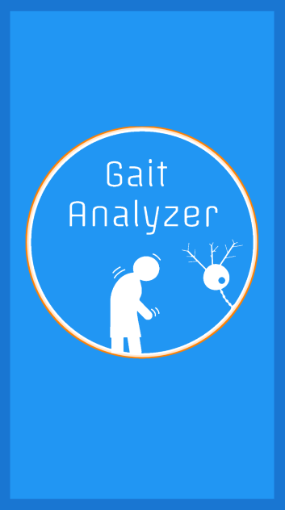

#### onboarding subpackage

This ui.onboarding subpackage deals with onboarding. I have introduced what the functionalities are, advertising for Parkinson’s Patients, with diagrams related to the root cause of this code.

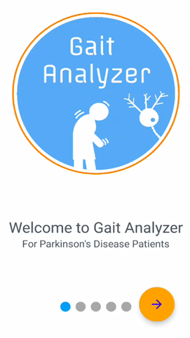

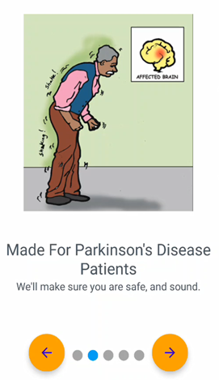

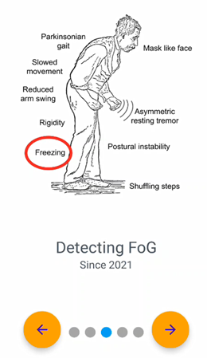


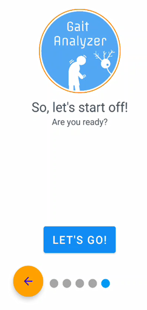

#### auth subpackage

The ui.auth subpackage deals with all the actual authentication process.

##### identification subpackage

Firstly, the fragment identification.IdentificationFragment is opened to streamline the two types of people. Although there is no difference in the next page, this was introduced so that the login process would be bigger. Based on previously done research, the elderly prefer bigger buttons and more attractive set-ups. Since most users of this application, at least in the case of the patients, are elderly, this is a crucial feature for usability.

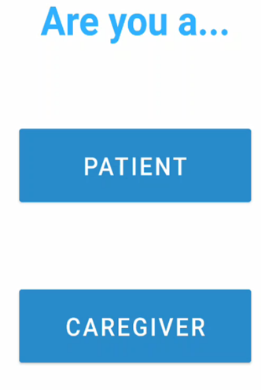

##### login and register subpackages

Upon selection, the AuthFragment fragment is opened. Here, a TabLayout is generated wherein you can Register or Login, entering a name and password. If you are to enter an existing account into register, the tab will automatically login for you.

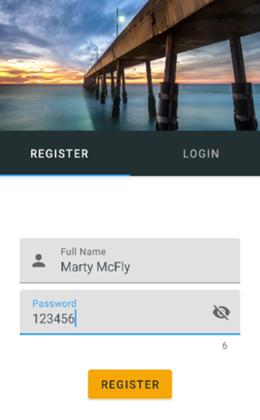

##### setup subpackage

If you are registering as a patient, you also have to input an emergency contact, who is the caregiver, using the setup.SetupFragment fragment. (see right) Not only would this update the caregiver fields in the patient’s data itself, but it also creates a new caregiver account if it doesn’t exist or update fields if the caregiver account exists.

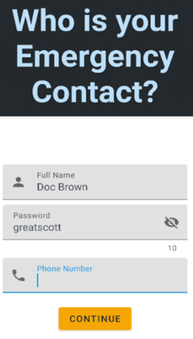

##### Firebase Cloud Storage

This details the entire login/register process. Firebase Cloud Firestore is accessed during the login, register and setup processes. Below shows the Firebase Document generated for Marty McFly. A few fields have been omitted for privacy reasons.

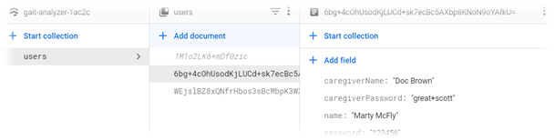

#### image and main subpackages

These subpackages deal with all the main functionality. Here, the MainFragment is opened in the MainActivity, which is the overall activity in this application. In the MainFragment, there is a bottom navigation menu + navigation bar menu set up to ease navigation at any point in time. The 4 main options that are hosted in the NavHostFragment that this navigation system handles are the **Home** page, **Profile** page, **Freeze** page and **Settings** page. Other than this, you can also handle an **Information** Page, About Application Page and About Programmer Page. While the first 5 have complex functionalities, the latter 2 have a more static design meant just to supply information using textual and visual data.

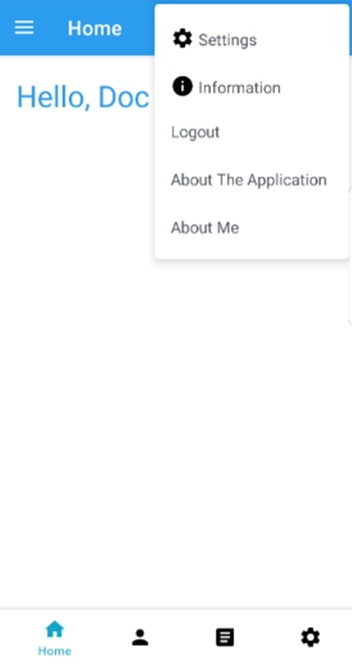

##### home subpackage

In the Home Page, the user is greeted by a friendly greeting, and given the user is a patient, also has the option to use a walk mode. The Walk Mode is meant for users to simply put their phones in their projects or somewhere around their thighs, and walk such that every 10 or so milliseconds, the accelerometer and gyroscopic data is detected and monitored to find freeze or fall events. In the caregiver’s screen however, this section will not exist since the caregiver is only interested in monitoring the freeze data, rather than the actual usage. The freeze is detected via the usage of raw acceleration data, a complementary filter and a Kalman filter to analyse and therefore interpret abnormalities.

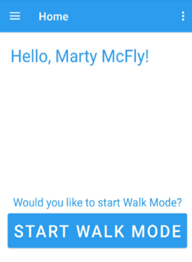

##### profile subpackage

The Profile Page is a similar page, where the user can see their profile. Since only a username and password is generated and this is not a social media application, there is not much data to be showcased. However, tapping the image open the ImageDetailsActivity, which is one of 2 activities in this application aside from the MainActivity. Here, a larger image is shown and the user can also go ahead and edit the image such that it opens from gallery or can be taken from the camera. Users then have the option to crop and customize the photo as they please. This is how the ui.image is utilized.

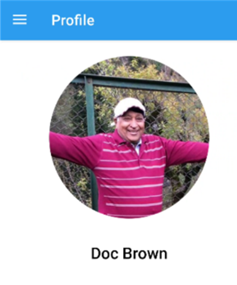

##### settings subpackage

The Settings Page is very simplistic, and users are allowed to set their profile picture, logout or turn on/off Dark Theme. Due to some strange bugs caused by the Android Ecosystem, the Dark Theme is currently kept at a Beta stage, and we suggest that users not use dark theme unless it proves absolutely necessary.


##### freeze subpackage

This is the page where most of the functionality is housed. A TabLayout is generated inside this FreezeFragment that contains two fragments, FreezeDataFragment and FreezesFragment, which are addressed as Data and Calendar respectively. 

###### freezedata subpackage

In Data, a master-detail flow page system is generated wherein the user is greeted with a RecyclerView, where each card shows the date it is representing as well the total number of freeze events on that day.

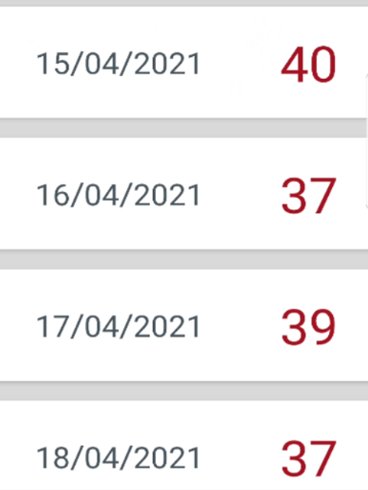

Upon tapping one of the cards in the RecyclerView, the user enters the SelectedFragment, identified as Freeze Data By Hour. Here, a bar chart is generated, showing the data for how many times a freeze event was detected per hour on that day.

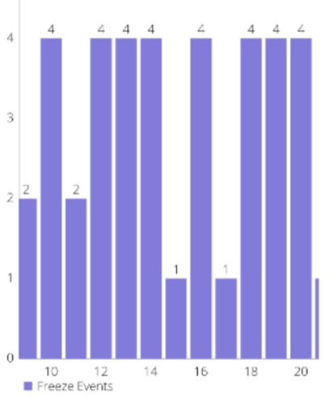

###### freezes subpackage

You can also go to the calendar tab (right), where the user can view Freeze Events based on the date. This is helpful for those users who have been using the app for a long time, since the list data would be very difficult to navigate through. However the constraints of the phone meant that the exact number of freeze events per hour are not showcase on top of each bar, which may hinder some view of progress.

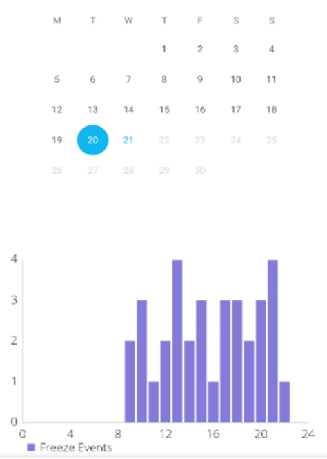

For both Bar Charts, scaling has been done and a legend has also been implemented so that users can easily interpret the data.

##### aboutapp subpackage - Information Page

The Information Page is designed mainly as a way to explain the context behind the project, like why we did it and what we did. The video showcased is simply a submission video by the SMP team to the HCI International Science Youth Forum (ISYF). You can pause and play the video as you please. The video can also be placed under Picture-In-Picture (PiP) mode so that users can still use the app while listening to the team talk about the application. 

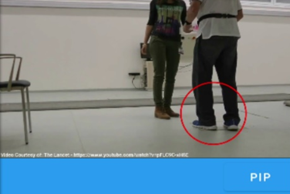

A WebView is also generated which shows the README of the original project, which can be found on the GitHub page of the application. This is an HTML page loading the GitHub CSS and is very intuitively shown. There is also a Text-To-Speech software, but my suggestion would be to not use it since it is still in Beta Mode.


## Reflection

### What are some obstacles faced?

The main obstacle I faced was that my original idea was way too complex for this. For example, originally, I was going to deploy an API on Firebase Hosting using Node.js and Python and using the ThunderSVM Library developed by the Xtra Computing Group at NUS, however I couldn’t use Firebase Hosting, so I tried Firebase Functions. However, Firebase Functions couldn’t format that either. I then tried to deploy the API on Heroku, and upon failure in achieving that, I went on to try creating a Flask API instead and hosting it on Firebase Hosting via Cloud Run, but in the end I had to give up because it was not very feasible given the time constraints and it was coming at expense of my UI.

### What have you learnt through the project?

I have learnt how to create a major application, and how to nest fragments. I had a triple-nested fragment in the application, and it was very interesting to see how useful Android Jetpack really was. I feel that this was a much more hectic project than last year’s, so that made this project a lot more stressful and I guess, it simulated the Mobile App Development Landscape for me, and I feel that was much appreciated, since it gave me an idea of the kind of situation I could be in down the line.

### What could you have done better if more time was given?

If I had more time, I would have implemented the actual API and actually utilised the machine learning algorithm I had developed in the original SMP project, in conjunction to the current algorithm, which I had to get from previously done research. I would have made the UI much more clear, since the Home Page and Profile Page both look quite jarringly empty. I could have made it look a lot more clear and helpful.

### How could the task be improved?

Similar to the point I raised last year, the task was very helpful for me, but I believe the main critique was the limitation of time. Nevertheless, I liked the fact that we could choose our own projects and am thankful to the CS teachers for asking us to do this rather than a test, since a timed condition may not be a very good way to test capability.


## Response

### Response 1

The application has a pretty niche application, which makes it convenient for such patients (such an application probably does not exist now). However, some of the screens look a bit lacklustre and empty; and not to mention the fact that the whole app relies primarily on 2 colours, making it more suited for light theme. However, if the recording of data is accurate, the whole application, together with the many visualisations, make it very impressive.

### Response 2

4/5 intuitive interface with simplistic design that successfully keeps in mind the physical difficulties that target users may encounter using the app and designing around that (i.e. 1 button to start/stop). Navigation is easy to remember after a few times. I am not the target audience. but assuming I was for example a Parkinson’s patient, I would find the UI very friendly and would help achieve my goal in analysing "my gait pattern".

### Response 3

The main functionality of gait analysis is there, so I am going to give you those sick complexity points for porting your SMP over to android. The plaintext password is not a good thing, and features like profile picture seem semi-counter intuitive if the doctor attached isn't going to see it. Might need a bit more information on the RecyclerViews, various pages, perhaps more information for users? (like additional patient data, maybe like where the doctor is practising, etc.) Overall, from a purely functional standpoint it is a 4 but like the UI being a bit lacklustre might drop the score a bit.

### Response 4

I like the simple to use UI and design of the application. It is very feature rich and easy to understand. The app is good for both doctor's and patient. I wouldn’t see myself using the application very often because I don’t have Parkinson’s Disease, but I could see myself recommending it to others who have the disease. I feel like there should be data or a graph to show the patient's progress with coping with the disease over time, I.e. a graph of average freezes per day against days, that way the doctor could easily track their progress. Navigation is good but I feel like both a navigation drawer and bottom navigation bar are unnecessary. The application helps the users achieve their goals as doctors and patients can easily use this app. I feel like the UI could be better, but on a scale of 1 to 5, I rate my experience using the mobile app as a 5.

### Response 5

5/5, nice graph, a lot of functionalities that will help your target audience. The colour of the data graph could have been selected better. Very beautiful pictures on login and smooth transitions.

